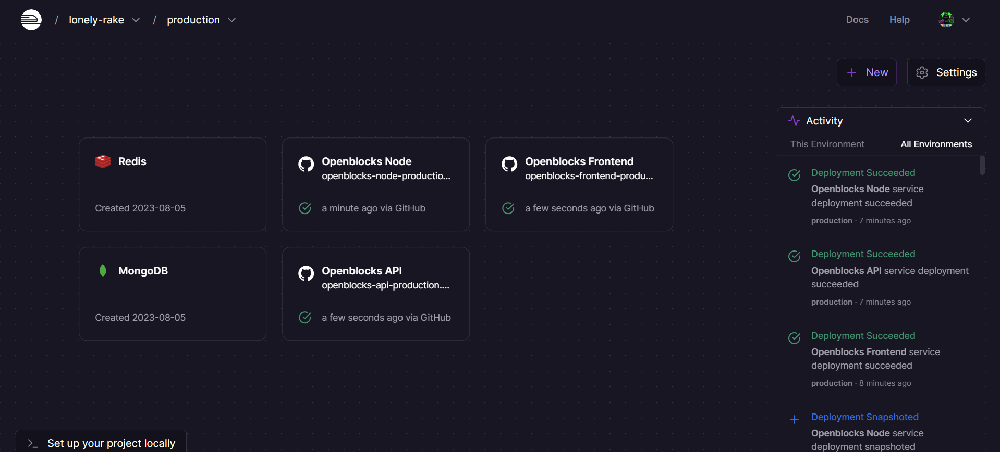
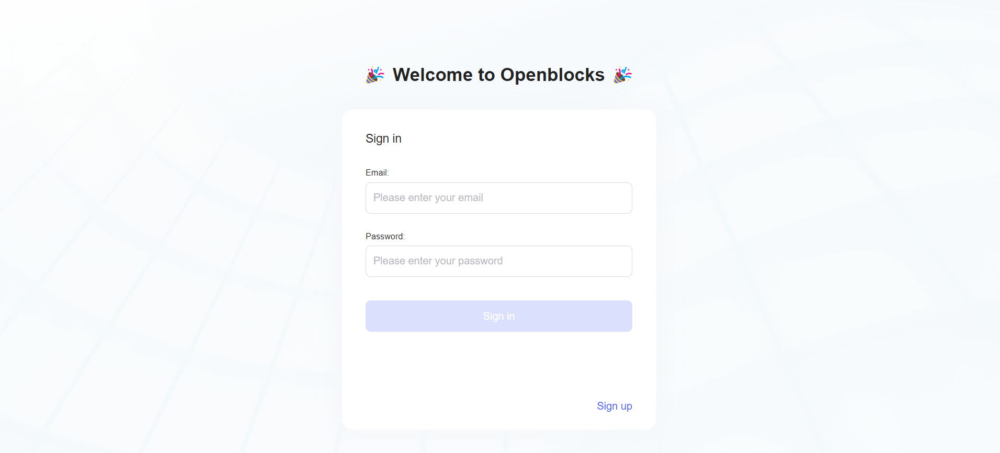
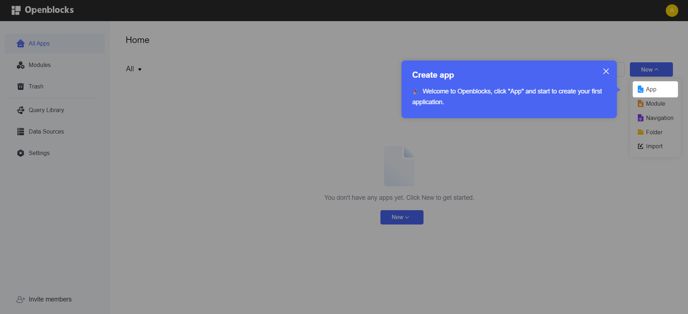
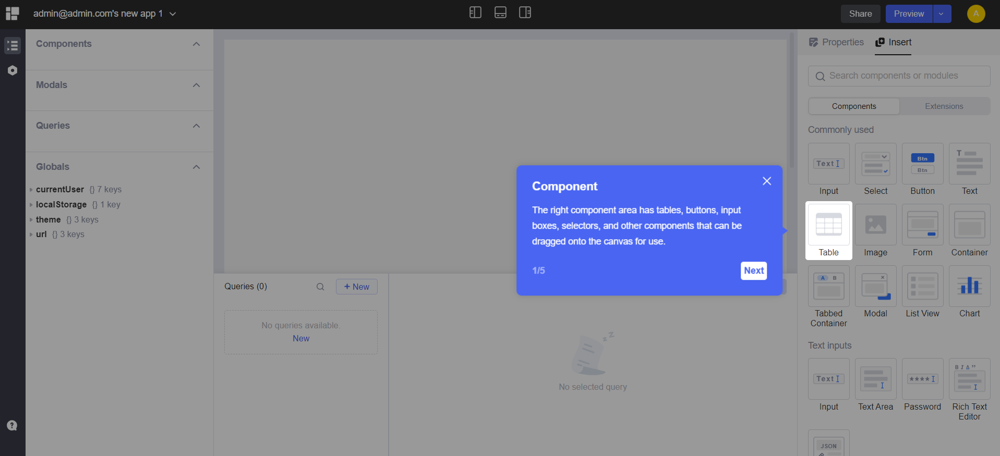
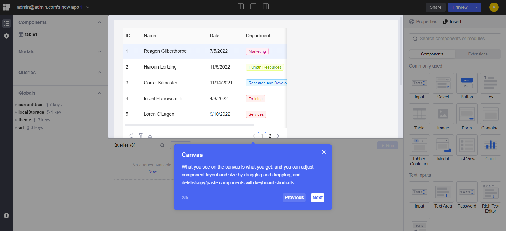
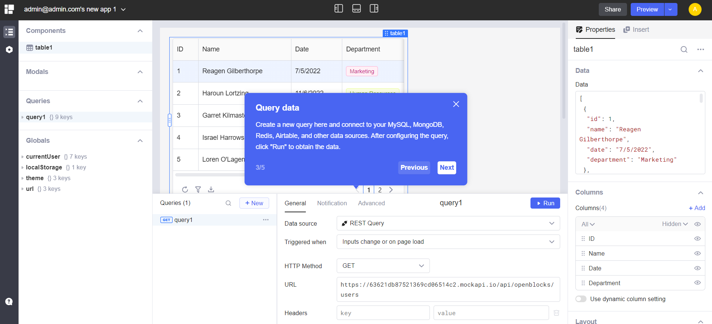

# Openblocks - Railway Template

This template deploys a self-hosted version of [Openblocks](https://openblocks.dev/). Openblocks is a developer-friendly open-source low code platform to build internal apps within minutes.

## What is Openblocks?
Openblocks is a developer-friendly open-source low code platform to build internal apps within minutes.
Traditionally, building an internal app requires complex frontend and backend interactions with hundreds and thousands lines of code, not to mention work on packaging, integration and deployment. Openblocks significantly reduces the work you need to do to build an app.
In Openblocks, all you need to do is drag and drop pre-built or self-customized components onto the What-You-See-Is-What-You-Get (WYSIWYG) canvas, along with ready-to-connect databases and APIs, Openblocks helps you build an app quickly and focus on business logic.

## ✨ Services

- Openblocks (Frontend, Node Backend and API)
- MongoDB (Database)
- Redis (Cache)

## Why choose Openblocks?
Open source: Makes your ideas more feasible.
All-in-one platform: Connection to all kinds of data sources and APIs such as MySQL, PostgreSQL, SQL Server, MongoDB, Redis, and Elasticsearch, and ensures your data security.
High scalability: Allows to execute JavaScript almost anywhere you would like to customize your business processes and UI components.
Clean design: Follows the principles of Ant Design and supports display on screens of different sizes. We have a number of templates and UI components, based on which you can freely build dashboard, admin panel, and content management system (CMS).
Built-in features: Provide cloud and self-hosted deployment, multi-tenant management, fine-grained access control, and audit logs.

## How to build an app in Openblocks?
Building an internal app basically takes 5 steps:
1. Quickly connect to your data sources, including PostgreSQL, MongoDB and online APIs.
2. Write a few lines of SQL or set up request parameters to build queries.
3. Use pre-built or user-customized UI components to build your app UI, bind and display queries' data with UI components.
4. Set up event handlers to trigger queries, control components or other actions in reaction to user interactions.
5. Preview and share your app with others.

## 💁‍♀️ How to use

- Click the Railway button 👆
- Update only required environment variables. Most of them are already set and doesn't need to be changed. If you want to configure or add more environment variables, follow this [guide](https://github.com/openblocks-dev/openblocks/tree/develop/deploy/docker)
- Deploy

- Visit the URL Railway provides
- Follow the instructions to set up your admin account

- Login with your admin account
- To Create a new App, Click on `New` and then `App`

- Adding a New component is simple and easy by dragging and dropping the components from the left panel to the canvas

- Center canvas is the canvas where you can drag and drop the components and build your app

- Right panel is the properties panel where you can set the properties of the components
- Bottom panel is the data panel where you can set the data source for the components and query the data

- Once you are done with the app, you can click on the `Preview` button on the top right corner to preview the app
- You can also share the app with others by clicking on the `Share` button on the top right corner
- You can export the app by clicking on the `Export` button on the top right corner and import it later 
- You can also deploy the app by clicking on the `Publish` button on the top right corner
- Enjoy 🎉

## ⚙️ Known issues
1. Openblock's API and Node service doesn't auto deploy or start after deploying  
   **Solutions**: 
   1. Pull the repository to your local machine and use the Railway CLI to link to the project, and run `railway up ` for both of the services to be deployed.
   
   2. Try redeploying the service which is hang up for long time from Railway UI and delete the old deployment instance once new instance is up and running.

## 📝 Notes

- Source repo: https://github.com/openblocks-dev/openblocks
- Docs: https://docs.openblocks.dev/self-hosting